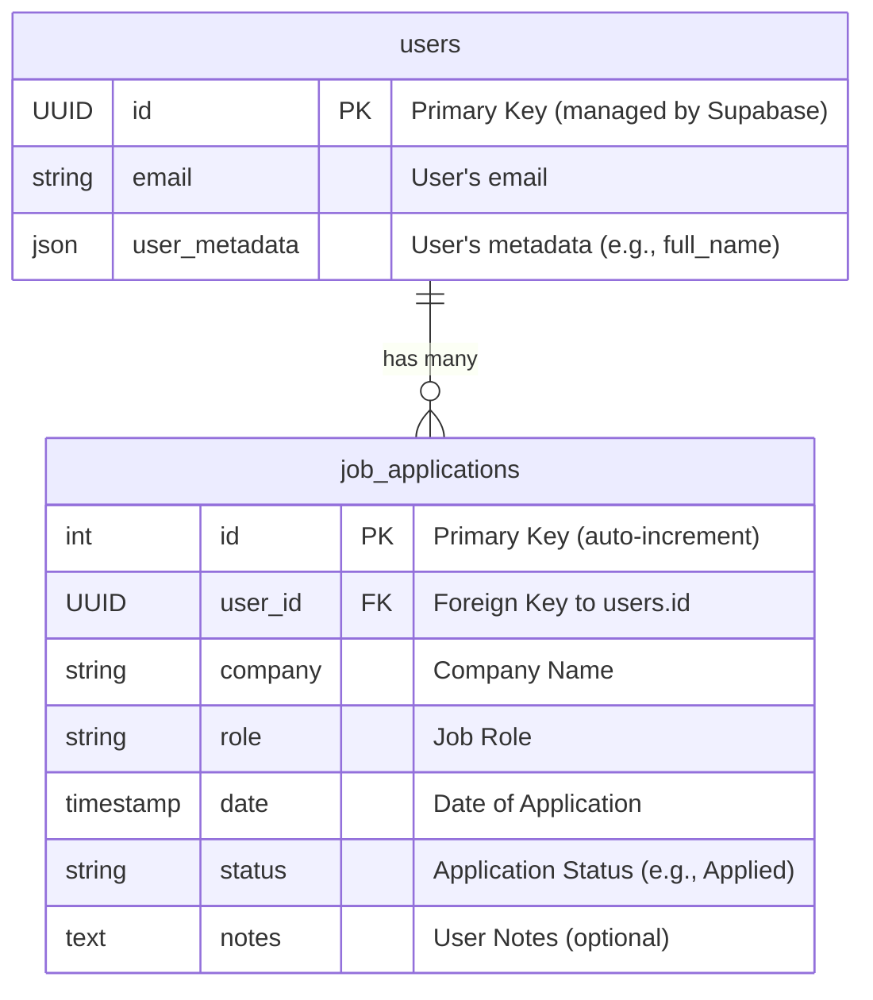

# JobTrackr: Professional Job Application Tracker

A simple, intuitive, and elegant job application tracking dashboard.

## ✨ Features

- **Secure Authentication**: Sign up and log in securely with email/password or Google, powered by Supabase Auth.
- **Intuitive Dashboard**: Get a quick overview of your application stats with clean, easy-to-read cards.
- **Application Tracking**: Add, update, and delete job applications with details like company, role, date applied, and status.
- **AI-Powered Suggestions**: Get smart suggestions for your application's status and generate starter notes for your applications.
- **Responsive Design**: A fully responsive layout that works beautifully on desktops, tablets, and mobile devices.
- **Data Export**: Export your application data to a CSV file with a single click.

## 🚀 Tech Stack

- **Framework**: [Next.js](https://nextjs.org/) (App Router)
- **UI**: [React](https://react.dev/)
- **Styling**: [Tailwind CSS](https://tailwindcss.com/)
- **Components**: [ShadCN UI](https://ui.shadcn.com/)
- **Database & Auth**: [Supabase](https://supabase.io/)
- **AI**: [Google AI & Genkit](https://firebase.google.com/docs/genkit)
- **Deployment**: [Firebase App Hosting](https://firebase.google.com/docs/app-hosting)

## 📦 Getting Started (Running This Project)

### Prerequisites

- [Node.js](https://nodejs.org/en) (v18 or later)
- [npm](https://www.npmjs.com/)

### 1. Set Up Environment Variables

Create a `.env` file in the root of your project and add your Supabase credentials and Gemini API key:

```bash
# Supabase credentials from your project's API settings
NEXT_PUBLIC_SUPABASE_URL="YOUR_SUPABASE_URL"
NEXT_PUBLIC_SUPABASE_ANON_KEY="YOUR_SUPABASE_ANON_KEY"
DATABASE_URL="YOUR_SUPABASE_DATABASE_CONNECTION_STRING"

# Gemini API key from Google AI Studio
GEMINI_API_KEY="YOUR_GEMINI_API_KEY"
```

### 2. Install Dependencies

```bash
npm install
```

### 3. Run the Database Migrations

```bash
npm run db:migrate
```

### 4. Run the Development Server

```bash
npm run dev
```

The application will be available at [http://localhost:9002](http://localhost:9002).

## 🗂️ Project Structure

```
.
├── src
│   ├── app         # Next.js App Router pages and layouts
│   ├── ai          # Genkit AI flows and configuration
│   ├── components  # Reusable React components
│   ├── lib         # Core logic, Supabase clients, and actions
│   ├── hooks       # Custom React hooks
│   └── middleware.ts # Next.js middleware for session management
├── supabase
│   └── migrations  # Database migration files
└── ...
```

## 📈 Database Schema (ERD)

This diagram shows the relationship between the `users` (managed by Supabase Auth) and the `job_applications` tables.



## 🛠️ Building It Yourself: A High-Level Guide

This project was initially created using [Firebase Studio](https://firebase.google.com/docs/studio), which automates much of the setup. However, you can build a similar application from scratch by following these steps.

### 1. Initialize Next.js Project

Start by creating a new Next.js application with TypeScript and Tailwind CSS.

```bash
npx create-next-app@latest my-job-tracker --typescript --tailwind --eslint
cd my-job-tracker
```

### 2. Set Up ShadCN UI

Integrate ShadCN UI for a library of high-quality, accessible components.

```bash
npx shadcn-ui@latest init
```

The CLI will ask you a few questions to configure `components.json`. You can accept the defaults or customize them. After initialization, add components as needed:

```bash
npx shadcn-ui@latest add button card input label
```

### 3. Set Up Supabase

Supabase handles your database and authentication.

1.  **Create a Supabase Project**: Go to [supabase.com](https://supabase.com), create an account, and start a new project.
2.  **Get API Credentials**: In your project's settings, find the API URL, `anon` key, and database connection string. Add them to your `.env` file.
3.  **Install Supabase SDK**: `npm install @supabase/supabase-js @supabase/ssr`
4.  **Define Schema**: Create a `supabase/migrations` directory and define your SQL schema for the `job_applications` table.

### 4. Implement Authentication and Actions

- Create Supabase clients for the server, client, and middleware.
- Implement server actions for `signIn`, `signUp`, and `signOut`.
- Set up protected routes using Next.js middleware to manage sessions.

### 5. Integrate Genkit for AI Features

Genkit powers the AI-driven suggestions and notes.

1.  **Install Genkit and Google AI Plugin**: `npm install genkit @genkit-ai/googleai @genkit-ai/next`
2.  **Get a Gemini API Key**: Obtain an API key from [Google AI Studio](https://aistudio.google.com/app/apikey) and add it to your `.env` file.
3.  **Configure Genkit**: Create an AI configuration file (`src/ai/genkit.ts`) to initialize Genkit with the Google AI plugin.
4.  **Create Flows**: Define Genkit flows (e.g., `src/ai/flows/suggest-application-status.ts`) that take job details as input and use a Gemini model to provide AI features.

This guide provides a high-level overview. Each step involves writing code for UI components, pages, and logic, which you can reference from this project's source code.
